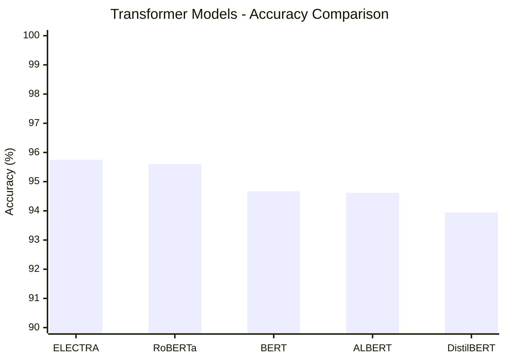
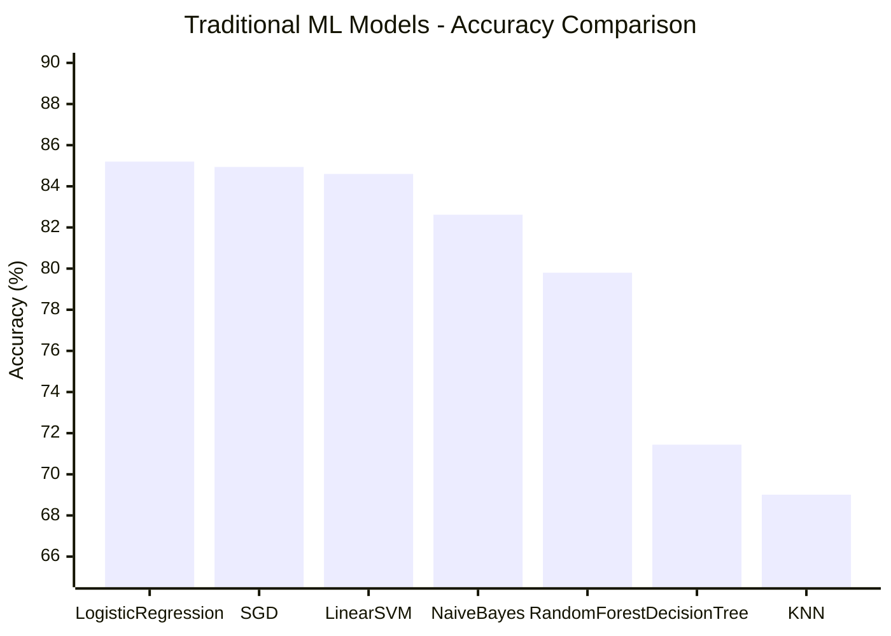

# Transformer-Based Amazon Review Sentiment Analysis

<p align="center">
  
  
  
  
  
</p>

A systematic comparison of transformer-based and traditional machine learning approaches for binary sentiment classification on the Amazon Polarity dataset. This project evaluates five Hugging Face transformer models against seven traditional ML baselines using identical data splits and evaluation protocols.

## 🚀 Quick Highlights

- Compared **5 Transformer models** (ELECTRA, BERT, RoBERTa, ALBERT, DistilBERT)
- Benchmarked against **7 Traditional ML algorithms**
- 🏆 **Overall Best Transformer**: ELECTRA-base
- 🎯 **Best Accuracy**: 95.75%
- ⭐ **Best F1 Score**: 95.75%
- ⚡ **Best Lightweight Model**: DistilBERT (66M parameters)
- 🏅 **Best Traditional Baseline**: Logistic Regression (85.20%)
- 📈 **~10.55 percentage-point improvement** over traditional ML
- 🔄 **Unified Hugging Face Transformer Pipeline**
- 📊 **Amazon Polarity Dataset** (60,000 samples)

---

## Project Overview

### Problem Statement

Customer reviews contain valuable insights for businesses, but manually analyzing thousands of reviews is impractical. Sentiment analysis automates this process by classifying reviews as positive or negative, enabling businesses to:
- Monitor product reception in real-time
- Identify product issues quickly
- Understand customer satisfaction at scale
- Make data-driven business decisions

### Research Objectives

This project conducts a controlled experiment to compare:
1. **Transformer models**: BERT, RoBERTa, DistilBERT, ALBERT, and ELECTRA
2. **Traditional ML models**: Logistic Regression, SVM, SGD, Naive Bayes, Random Forest, Decision Tree, and KNN

All models are trained and evaluated on the **same dataset** with **consistent preprocessing** to ensure fair comparison.

---

## Features

- **Multi-Model Benchmark**: 5 transformer models + 7 traditional ML models
- **Fair Comparison**: Identical dataset, train/test split, and evaluation metrics across all models
- **Unified Training Pipeline**: Same preprocessing, tokenizer workflow, and training procedure for all transformers
- **Amazon Polarity Dataset**: 60,000 samples (50,000 train + 10,000 test) from Hugging Face
- **Comprehensive Evaluation**: Accuracy, precision, recall, and F1 score for all models
- **Reproducible Results**: Fixed random seeds and documented experimental protocol
- **Production-Ready Code**: Modular architecture with CLI interface for training and inference

---

## Tech Stack

| Category | Technology |
|----------|-----------|
| **Language** | Python 3.8+ |
| **Deep Learning** | PyTorch |
| **NLP Library** | Hugging Face Transformers |
| **Dataset Loading** | Hugging Face Datasets |
| **Numerical Computing** | NumPy |
| **Machine Learning** | Scikit-learn |
| **Data Processing** | Pandas |
| **Development** | Git, GitHub |

---

## Project Structure

```
Amazon Research/
│
├── configs/
│   └── config.py                    # Central configuration (hyperparameters, paths, settings)
│
├── models/
│   ├── bert_finetuned/              # Fine-tuned BERT model artifacts (gitignored)
│   │   ├── best_model/              # Best model checkpoint
│   │   ├── checkpoints/             # Training checkpoints
│   │   └── tokenizer/               # Saved tokenizer files
│   │
│   └── traditional_ml/              # Traditional ML models (TF-IDF + scikit-learn)
│       ├── decision_tree/           # Decision Tree model
│       ├── knn_classifier/          # K-Nearest Neighbors
│       ├── linear_svm/              # Linear SVM
│       ├── logistic_regression/     # Logistic Regression
│       ├── multinomial_naive_bayes/ # Multinomial Naive Bayes
│       ├── random_forest/           # Random Forest
│       └── sgd_classifier/          # SGD Classifier
│
├── reports/                         # Evaluation metrics and results
│   ├── eval_metrics.json            # BERT test set evaluation results
│   ├── train_metrics.json           # BERT training history
│   ├── *_metrics.json               # Traditional ML model metrics
│
├── src/
│   ├── __init__.py
│   ├── main.py                      # CLI orchestrator
│   │
│   ├── dataset_loaders/             # Dataset loading utilities
│   │   ├── __init__.py
│   │   └── amazon_reviews_2023.py   # Amazon Reviews dataset loader
│   │
│   ├── text/                        # BERT transformer pipeline
│   │   ├── __init__.py
│   │   ├── preprocessing.py         # Tokenization and dataset preparation
│   │   ├── model.py                 # Model loading and configuration
│   │   ├── train.py                 # Training pipeline
│   │   ├── evaluation.py            # Model evaluation
│   │   ├── inference.py             # Single-text prediction
│   │   └── metrics.py               # Metrics computation
│   │
│   ├── traditional_ml/              # Traditional ML pipeline (TF-IDF + sklearn)
│   │   ├── __init__.py
│   │   ├── preprocessing.py         # Text cleaning and TF-IDF features
│   │   ├── trainer.py               # Unified training pipeline
│   │   ├── evaluation.py            # Model evaluation
│   │   ├── README.md                # Traditional ML documentation
│   │   └── models/                  # Individual model implementations
│   │       ├── decision_tree.py
│   │       ├── knn_classifier.py
│   │       ├── linear_svm.py
│   │       ├── logistic_regression.py
│   │       ├── multinomial_naive_bayes.py
│   │       ├── random_forest.py
│   │       └── sgd_classifier.py
│   │
│   └── utils/                       # Shared utilities
│       ├── __init__.py
│       └── metrics.py
│
├── .gitignore                       # Git ignore rules
├── LICENSE                          # MIT License
├── README.md                        # This file
├── requirements.txt                 # Python dependencies
└── simple_inference.py              # Quick inference script for BERT model
```

---

## Architecture

### Pipeline Overview


**Pipeline Components:**
1. **Dataset Loader**: Streams Amazon Polarity dataset from Hugging Face Hub
2. **Text Preprocessing**: Cleans and normalizes review text
3. **Tokenizer**: Converts text to model-specific token IDs (WordPiece/BPE)
4. **Transformer Backbone**: Pretrained model (BERT, RoBERTa, ELECTRA, etc.)
5. **Fine-Tuning**: Trains model on sentiment classification task
6. **Evaluation**: Measures accuracy, precision, recall, F1 on held-out test set
7. **Sentiment Prediction**: Classifies new reviews as Positive/Negative

---

## Model Architecture

### Transformer Models

This project evaluates five transformer architectures from Hugging Face:

**BERT-base**: 12 layers, 12 attention heads, 768 hidden dimensions, 110M parameters
**RoBERTa-base**: 12 layers, 12 attention heads, 768 hidden dimensions, 125M parameters
**DistilBERT**: 6 layers, 12 attention heads, 768 hidden dimensions, 66M parameters (distilled)
**ALBERT-base-v2**: 12 layers, 12 attention heads, 768 hidden dimensions, 12M parameters (parameter-sharing)
**ELECTRA-base**: 12 layers, 12 attention heads, 768 hidden dimensions, 110M parameters

All models use:
- **WordPiece tokenization** with 128 token max length
- **[CLS] token** for classification
- **Dropout regularization** for generalization

### Traditional ML Models

Seven traditional models using TF-IDF features (10,000 features, 1-2 n-grams):
- **Logistic Regression**: Linear classifier with L2 regularization
- **Linear SVM**: Support Vector Machine with linear kernel
- **SGD Classifier**: Stochastic Gradient Descent with hinge loss
- **Multinomial Naive Bayes**: Probabilistic classifier with feature independence assumption
- **Random Forest**: Ensemble of 200 decision trees
- **Decision Tree**: Single tree with max depth 30
- **KNN**: K-Nearest Neighbors with cosine distance (k=5)

---

## Dataset

### Amazon Polarity Dataset

The [Amazon Polarity Dataset](https://huggingface.co/datasets/fancyzhx/amazon_polarity) contains Amazon product reviews labeled for binary sentiment classification.

**Dataset Statistics:**
- **Task**: Binary classification (Positive vs Negative)
- **Total samples**: 60,000 (50,000 train + 10,000 test)
- **Positive reviews**: 30,631 (51.1%)
- **Negative reviews**: 29,369 (48.9%)
- **Balance**: Reasonably balanced (~51% positive)
- **Loading**: Streaming mode from Hugging Face Hub

**Preprocessing:**
- Text tokenization using model-specific tokenizers (transformers) or TF-IDF (traditional ML)
- Sequence length: 128 tokens for transformers
- TF-IDF: 10,000 features with (1,2) n-grams for traditional ML
- Text cleaning: Lowercase, remove URLs, emails, special characters

---

## Training Details

### Unified Training Pipeline

All transformer models use the **same training procedure** with only the model backbone changed:

**Training Configuration:**
- **Epochs**: 3
- **Batch Size**: 8
- **Learning Rate**: 2e-5
- **Optimizer**: AdamW with weight decay 0.01
- **Scheduler**: Linear warmup (10% of steps) with decay
- **Max Sequence Length**: 128 tokens
- **Random Seed**: 42

> **💡 Pro Tip:** The unified training pipeline allows you to switch between transformer models by changing only the `model_name` in `configs/config.py`. All other training logic remains identical, ensuring fair comparison.

**Training Process:**
1. Load Amazon Polarity dataset from Hugging Face Hub (streaming mode)
2. Tokenize text using model-specific tokenizer
3. Fine-tune model for 3 epochs with gradient accumulation
4. Save best checkpoint based on validation loss
5. Evaluate on held-out test set

**Reproducibility:**
- ✅ Fixed random seeds for all operations
- ✅ Documented hyperparameters in `configs/config.py`
- ✅ Training runtime: ~57.67 seconds (BERT, 3 epochs, CPU)

---

## Experimental Design

### Dataset Split

- **Training set**: 50,000 samples (used for model fine-tuning)
- **Test set**: 10,000 samples (held-out, never used during training)
- **Validation set**: Materialized from test split during BERT training

### Evaluation Protocol

**Transformer Models:**
- Evaluated on full test set (10,000 samples)
- Metrics: Accuracy, Precision, Recall, F1 Score
- Best model selected based on validation loss

**Traditional ML Models:**
- Evaluated on full test set (10,000 samples)
- Metrics: Accuracy, Precision, Recall, F1 Score
- Train/test split: 80/20 with stratification

### Fair Comparison Guarantee

All models (transformers and traditional ML) use:
- **Same dataset source**: `fancyzhx/amazon_polarity`
- **Same train/test split**: 50,000 train / 10,000 test
- **Same random seed**: 42
- **Same evaluation metrics**: Accuracy, Precision, Recall, F1

---

## Results

### 🏆 Transformer Models Benchmark

| Rank | Model | Accuracy | Precision | Recall | F1 Score |
|:----:|-------|----------:|----------:|--------:|---------:|
| 🥇 1st | **ELECTRA-base** | **95.75%** | **95.75%** | **95.75%** | **95.75%** |
| 🥈 2nd | **RoBERTa-base** | 95.60% | 95.60% | 95.60% | 95.60% |
| 🥉 3rd | **BERT-base** | **94.67%** | **94.81%** | **94.79%** | **94.80%** |
| 4️⃣ 4th | **ALBERT-base-v2** | 94.61% | 95.32% | 94.11% | 94.71% |
| 5️⃣ 5th | **DistilBERT** | 93.94% | 94.30% | 93.90% | 94.10% |

**Key Findings:**
- ✅ All transformer models achieve **>93% accuracy** on the test set
- 🏆 **ELECTRA-base** achieves 🎯 **best accuracy** (95.75%) and ⭐ **best F1 score** (95.75%)
- 🥈 **RoBERTa-base** achieves second-best performance (95.60% accuracy, 95.60% F1)
- 🥉 **BERT-base** achieves third-best performance (94.67% accuracy, 94.80% F1)
- ⚡ **DistilBERT** (66M parameters) performs competitively despite being 40% smaller
- 💡 **ALBERT-base-v2** (12M parameters) achieves 94.61% accuracy with parameter-sharing

### Benchmark: Traditional ML Models

| Model | Accuracy | Precision | Recall | F1 Score |
|-------|----------:|----------:|--------:|---------:|
| **Logistic Regression** | **85.20%** | **84.89%** | **86.52%** | **85.70%** |
| **SGD Classifier** | 84.94% | 84.58% | 86.36% | 85.46% |
| **Linear SVM** | 84.60% | 84.29% | 85.97% | 85.12% |
| **Multinomial Naive Bayes** | 82.62% | 81.91% | 84.82% | 83.34% |
| **Random Forest** | 79.80% | 77.89% | 84.60% | 81.11% |
| **Decision Tree** | 71.44% | 76.92% | 63.26% | 69.42% |
| **KNN** | 69.01% | 68.82% | 72.27% | 70.51% |

**Key Findings:**
- **Logistic Regression** achieves best traditional ML performance (85.20% accuracy)
- Linear models (Logistic Regression, SGD, SVM) perform similarly (84-86%)
- **Multinomial Naive Bayes** underperforms linear models (82.62%)
- Tree-based models (Random Forest, Decision Tree) show lower performance
- **KNN** performs worst (69.01%) due to high dimensionality of TF-IDF features

### Performance Summary

| Category | Best Model | Accuracy | F1 Score |
|----------|-----------|----------|----------|
| **Overall Best** | ELECTRA-base | **95.75%** | **95.75%** |
| **Best Transformer** | ELECTRA-base | **95.75%** | **95.75%** |
| **Best Traditional ML** | Logistic Regression | **85.20%** | **85.70%** |
| **Best Lightweight Model** | DistilBERT | 93.94% | 94.10% |
| **Best Parameter-Efficient** | ALBERT-base-v2 | 94.61% | 94.71% |

**Performance Gap:**
- Transformers outperform traditional ML by **~10-11 percentage points** in accuracy
- Best transformer (ELECTRA-base, 95.75%) vs best traditional (Logistic Regression, 85.20%)
- F1 score gap: **~10 percentage points** (95.75% vs 85.70%)

---

## Performance Comparison

### Transformer Models Accuracy



### Traditional ML Models Accuracy



---

## Why Transformers Outperform Traditional ML

### Experimental Findings

The benchmark results demonstrate that transformer models **significantly outperform** traditional ML approaches on this sentiment analysis task:

**Accuracy Gap: 10.55 percentage points** (95.75% vs 85.20%)

### Technical Reasons

1. **Context Understanding**: Transformers use attention mechanisms to understand word relationships in context. For example, "not good" is correctly classified as negative, while traditional ML may struggle with negation.

2. **Semantic Representations**: Pretrained transformers capture deep semantic meaning from large corpora, while TF-IDF only captures surface-level word frequencies.

3. **Bidirectional Context**: BERT-style models process text bidirectionally, understanding words from both left and right contexts simultaneously.

4. **Transfer Learning**: Transformers leverage knowledge from pretraining on massive text corpora, requiring only fine-tuning on the target task.

5. **Subword Tokenization**: WordPiece/BPE tokenization handles out-of-vocabulary words effectively, unlike traditional bag-of-words approaches.

### When to Use Each Approach

**Use Transformers When:**
- Maximum accuracy is required (95%+ vs 85%)
- Context and semantics are important
- Computational resources are available
- Model deployment latency is acceptable

**Use Traditional ML When:**
- Fast training and inference are critical
- Interpretability is required (feature importance available)
- Computational resources are limited
- Baseline performance (85%) is sufficient

---

## Installation

### Prerequisites

- Python 3.8 or higher
- pip package manager
- 4GB+ RAM (8GB+ recommended for transformer training)
- Optional: CUDA-capable GPU or Apple Silicon Mac for faster training

### Setup Instructions

1. **Clone the repository:**
```bash
git clone https://github.com/vivekcode12345/transformer-amazon-sentiment-analysis.git
cd transformer-amazon-sentiment-analysis
```

2. **Create a virtual environment:**
```bash
python -m venv .venv
source .venv/bin/activate  # On Windows: .venv\Scripts\activate
```

3. **Install dependencies:**
```bash
pip install -r requirements.txt
```

---

## Usage

### Training Transformer Models

Train BERT on the Amazon Polarity dataset:

```bash
python -m src.main text-train
```

**What happens during training:**
1. Loads Amazon Polarity dataset from Hugging Face Hub (50k train / 10k test)
2. Tokenizes text using BERT tokenizer
3. Fine-tunes BERT for 3 epochs
4. Saves best model checkpoint to `models/bert_finetuned/best_model/`
5. Saves tokenizer to `models/bert_finetuned/tokenizer/`
6. Logs training metrics to `reports/train_metrics.json`

**Training time:** Approximately 15-30 minutes on CPU, 5-10 minutes on GPU

**To switch models:** Edit `configs/config.py` and change `model_name`:
```python
TEXT_CONFIG.model_name = "google/electra-base-discriminator"  # ELECTRA
TEXT_CONFIG.model_name = "bert-base-uncased"  # BERT
TEXT_CONFIG.model_name = "roberta-base"  # RoBERTa
TEXT_CONFIG.model_name = "albert-base-v2"  # ALBERT
TEXT_CONFIG.model_name = "distilbert-base-uncased"  # DistilBERT
```

### Evaluating Models

Evaluate the fine-tuned model on the test set:

```bash
python -m src.main text-eval
```

**Output:**
- Accuracy, precision, recall, F1 score
- Confusion matrix
- Detailed classification report
- Results saved to `reports/eval_metrics.json`

### Running Inference

Predict sentiment for a single review:

```bash
python -m src.main text-predict "This product is amazing! Best purchase I've made."
```

**Example Output:**
```
Prediction Result
------------------------------------------------------------
Text: This product is amazing! Best purchase I've made.
Predicted Label: Positive
Confidence: 0.9523
Probabilities: {'negative': 0.0477, 'positive': 0.9523}
```

**Python API:**
```python
from src.text.inference import predict_sentiment, print_prediction_result

result = predict_sentiment("This product exceeded my expectations!")
print_prediction_result(result)
```

### Training Traditional ML Models

Train all traditional ML models:

```bash
python src/traditional_ml/models/logistic_regression.py
python src/traditional_ml/models/linear_svm.py
python src/traditional_ml/models/sgd_classifier.py
# ... etc
```

Or use the unified trainer:
```python
from src.traditional_ml.trainer import train_model
from sklearn.linear_model import LogisticRegression

model, vectorizer, metrics, X_train, X_test, y_train, y_test = train_model(
    model=LogisticRegression(),
    model_name="Logistic Regression",
    model_output_dir="models/traditional_ml/logistic_regression",
    metrics_output_path="reports/logistic_regression_metrics.json",
)
```

### Interactive Mode

Launch the interactive CLI menu:

```bash
python -m src.main
```

**Menu Options:**
1. Preview tokenization on a small sample
2. Train BERT on Amazon Polarity
3. Evaluate saved model
4. Predict sentiment for a single review
5. View configuration
6. Exit

---

## Model Configuration

Edit `configs/config.py` to customize training:

```python
from configs.config import TEXT_CONFIG

# Model selection - change this to use different transformers
TEXT_CONFIG.model_name = "bert-base-uncased"  # Default

# Supported models:
# - "bert-base-uncased"
# - "distilbert-base-uncased"
# - "roberta-base"
# - "albert-base-v2"
# - "microsoft/deberta-v3-base"
# - "google/electra-base-discriminator"

# Training hyperparameters
TEXT_CONFIG.learning_rate = 2e-5
TEXT_CONFIG.epochs = 3
TEXT_CONFIG.batch_size = 8
TEXT_CONFIG.max_length = 128
```

The pipeline automatically adapts to different models using Hugging Face's `AutoTokenizer` and `AutoModelForSequenceClassification`.

---

## Future Improvements

- **Hyperparameter Tuning**: Implement Optuna for automated hyperparameter optimization
- **Cross-Validation**: Add k-fold cross-validation for more robust evaluation
- **Multi-Class Sentiment**: Extend to 5-class classification (1-5 star ratings)
- **Explainable AI**: Add LIME/SHAP for model interpretability
- **Docker Deployment**: Containerize the application for easy deployment
- **FastAPI Deployment**: Build REST API for production inference
- **Hugging Face Deployment**: Deploy model to Hugging Face Spaces for live demo
- **Model Ensembling**: Combine multiple models for better accuracy
- **Experiment Tracking**: Integrate Weights & Biases or MLflow for experiment management
- **ONNX Export**: Optimize model for production deployment

---

## License

This project is licensed under the MIT License - see the [LICENSE](LICENSE) file for details.

---

## Author

**Vivek Verma**

Computer Science Engineering Student | Backend Developer | Machine Learning Enthusiast | AI Developer

Passionate about building production-ready ML systems and applying cutting-edge NLP techniques to solve real-world problems.

**GitHub**: [@vivekcode12345](https://github.com/vivekcode12345)

**LinkedIn**: [Vivek Verma](https://www.linkedin.com/in/vivekverma)

---

## Citation

If you use this project in your research or work, please cite:

```bibtex
@software{transformer_amazon_sentiment,
  title = {Transformer-Based Amazon Review Sentiment Analysis},
  author = {Vivek Verma},
  year = {2025},
  url = {https://github.com/vivekcode12345/transformer-amazon-sentiment-analysis}
}
```

---

## Acknowledgments

- [Hugging Face](https://huggingface.co/) for providing pretrained transformer models and the Transformers library
- [Amazon Polarity Dataset](https://huggingface.co/datasets/fancyzhx/amazon_polarity) for the benchmark dataset
- [BERT: Pre-training of Deep Bidirectional Transformers for Language Understanding](https://arxiv.org/abs/1810.04805) (Devlin et al., 2018)

---

## Contact

For questions, feedback, or collaboration opportunities, please open an issue on GitHub or reach out via LinkedIn.

**⭐ Star this repository if you find it helpful!**